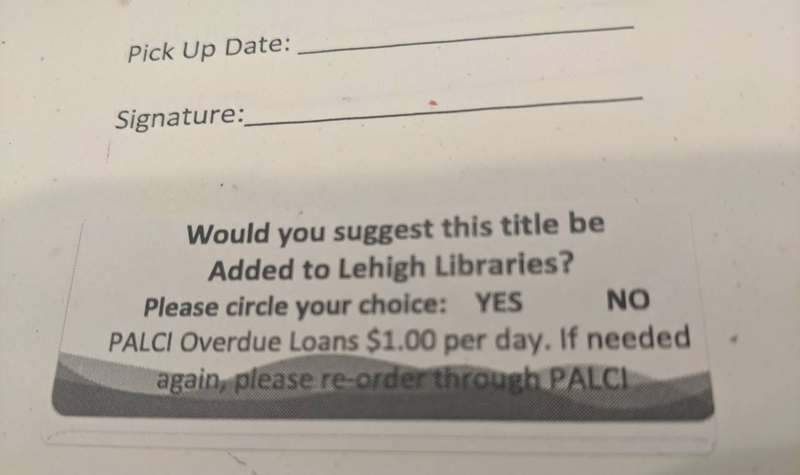

# Purchase Request Returns Client

The Returns Client allows patrons who are returning an interlibrary loan book to suggest that their local library purchase a copy for its own collection.

* The patron [indicates on the return slip](#return-slips) that they are suggesting the purchase.
* Library staff look for that indication when an item is returned, and use the Returns Client to submit a purchase request to the [Purchase Request Workflow Proxy Server](https://github.com/lehigh-university-libraries/purchase-request-workflow-proxy-server) for consideration by librarian selectors.
    * The Workflow Proxy Server centralizes purchase requests from different sources, enriches them with information to help selector decision-making, and routes them to external systems for post-decision processing.

## Return Slips

The return slip template should ask some form of the question "Would you suggest this title be added to X library?  Yes / No", allowing the patron to circle a "Yes" response.  How to do that is beyond the scope of this application, but possible methods include:

* Adding a sticker with with the question (see example photo)
* Using an ink stamp to add the question
* Editing the printed return slip template itself

## Scanning and Submitting a Purchase Request

The single page web-based workflow is designed to be as quick and simple as possible.

1. Scan the transaction ID barcode from the return slip.  Use a standard barcode scanner or type the barcode manually.
    1. The Returns Client displays the title, author and ISBN, as well as a cover image if one is available, so the staff member can confirm it's the right item.
1. (Optional) Enter any comments the patron scribbled on the return slip.
1. Hit the enter key (or click OK).  
    1. The request is sent to the Workflow Proxy Server for librarian consideration.

## Supported Loan Systems

The Returns Client currently supports:

| System | Connection | Note |
| -- | -- | -- |
| ILLiad | API |
| ReShare | Database |
| FOLIO | API | Depends on the information available in the temporary loan records created. |

Connections are individually enabled and configurable.  Suggestions & pull requests welcome to support additional systems.

## Deployment and Authentication

The Returns Client is a Java Spring Boot web application.  Like the Workflow Proxy Server, it can be deployed either as a standalone application or embedded in a Java application server.

Follow the [deployment instructions for the Workflow Proxy Server](https://github.com/lehigh-university-libraries/purchase-request-workflow-proxy-server#deployment), substituting `purchase-request-returns-client.war` for the name of the deployed file.  

There are two authentication scenarios supported depending which deployment option you select.

### Production Deployment with External Authentication

The recommended production deployment uses the [Deployed to Jetty](https://github.com/lehigh-university-libraries/purchase-request-workflow-proxy-server#deployed-to-jetty) instructions combined with external authentication.  

- Configure the production web server (i.e. Apache Web Server) to authenticate the user (i.e. via LDAP) before passing the web request to the application server (i.e. Jetty).
- The web server should set a `X-Remote-User` request header with the staff member's username.

### Test Deployment with Internal Authentication

For testing purposes using a [standalone WAR file](https://github.com/lehigh-university-libraries/purchase-request-workflow-proxy-server#standalone-war-file-with-embedded-tomcat), the application supports authenticating with credentials stored (encrypted) in a local SQL database.

Scripts are available to add and remove user credentials. They utilize the same purchase-request-returns-client.war file as the application, and the same configuration file.

#### Add User Credentials

In the project home directory, run:

    scripts/add_user.sh username password

#### Delete User Credentials

In the project home directory, run:

    scripts/delete_user.sh username

## Dependencies

- Java SE.  Tested on Java SE 11 (LTE).
- Workflow Proxy Server
- One or more [supported loan systems](#supported-loan-systems).

## Initial Setup

1. Create a Workflow Proxy Server user for API access by the Returns Client.  See [Client User Management](https://github.com/lehigh-university-libraries/purchase-request-workflow-proxy-server#client-user-management).

1. Determine which [authentication method](#authentication) library staff will use to access the Returns Client.

1. Set up the [configuration file](#configuration).

## Configuration

Copy/rename `application.properties.example` to `application.properties` and configure its parameters.  See example values in that file.

| Property | Description | Required |
| -- | -- | -- |
| returns-client.enabled |  Enable the application. Must be 'true'.  | Y |

### Security / Authentication

| Property | Description | Required |
| -- | -- | -- |
| returns-client.authentication | `external` or `internal` | Y |
| returns-client.disable-security | Should be `true` to disable security for `external` authentication, or `false` to display a login screen for `internal` authentication. | Y |

#### Internal Authentication 

| Property | Description | Required |
| -- | -- | -- |
| returns-client.db.host | Database hostname | If `returns-client.authentication` is `internal`. |
| returns-client.db.name | Database name | If `returns-client.authentication` is `internal`.
| returns-client.db.username | Database username | If `returns-client.authentication` is `internal`. |
| returns-client.db.password | Database password | If `returns-client.authentication` is `internal`. |

### ILLiad Section

| Property | Description | Required |
| -- | -- | -- |
| returns-client.illiad.base-url | Base URL for the ILLiad API.  Include this property to enable ILLiad as a loan source. | N |
| returns-client.illiad.api-key | API Key for the Illiad API. | If `returns-client.illiad.base-url` is specified. |

### ReShare Section

For connecting to a database of ReShare transaction records.

| Property | Description | Required |
| -- | -- | -- |
| returns-client.reshare.db.host | Database hostname.  Include this property to enable ReShare as a loan source. | N |
| returns-client.reshare.db.name | Database name | If `returns-client.reshare.db.host` is specified. |
| returns-client.reshare.db.username | Database username | If `returns-client.reshare.db.host` is specified. |
| returns-client.reshare.db.password | Database password | If `returns-client.reshare.db.host` is specified.  |
| returns-client.reshare.barcodeRegex | Regular expression matching a ReShare barcode label.  Generally some letters followed by numbers. | If `returns-client.reshare.db.host` is specified. |

### FOLIO Section
 
For connecting to the FOLIO API.

Note: The specified FOLIO user account should have the following permissions:

* Inventory: View instances, holdings, and items

| Property | Description | Required |
| -- | -- | -- |
| returns-client.folio.okapiBaseUrl | Base URL for FOLIO OKAPI API calls. Include this property to enable FOLIO as a loan source. | N |
| returns-client.folio.username | Username for the FOLIO API. See permissions required above. | If `returns-client.folio.okapiBaseUrl` is specified. |
| returns-client.folio.password | Password for the FOLIO API. | If `returns-client.folio.okapiBaseUrl` is specified. |
| returns-client.folio.tenantId | Tenant ID for the FOLIO server environment. | If `returns-client.folio.okapiBaseUrl` is specified. |
| returns-client.folio.barcodeRegex | Regular expression matching a FOLIO barcode label.  Generally some letters followed by numbers. | If `returns-client.folio.okapiBaseUrl` is specified. |

### Workflow Proxy Server Section

For connecting to the Purchase Request Workflow Proxy Server via its API.

| Property | Description | Required |
| -- | -- | -- |
| returns-client.workflow-server.username | API username | Y |
| returns-client.workflow-server.password | API password | Y |
| returns-client.workflow-server.base-url | API base URL | Y |

### Debugging

Optional properties.  See other [Spring Boot logging properties](https://docs.spring.io/spring-boot/docs/current/reference/html/features.html#features.logging) as well.

| Property | Description | Required |
| -- | -- | -- |
| logging.level.edu.lehigh.libraries.purchase_request | To optionally change the default [SLF4J](https://www.slf4j.org/index.html) logging [level](https://www.slf4j.org/api/org/slf4j/event/Level.html#enum.constant.summary) from INFO. `DEBUG`, `ERROR`, etc. | N |
